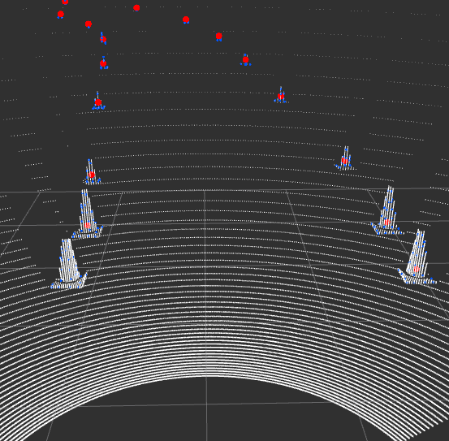

# Cones Perception via LiDAR Sensor



A ROS package for detecting and classifying traffic cones in LiDAR point cloud data using PCL (Point Cloud Library) and clustering algorithms.

## 🚀 Features

- **Real-time cone detection** from LiDAR point clouds
- **Color classification** of detected cones (yellow, blue, orange, unknown)
- **Ground removal** preprocessing for improved accuracy
- **Multiple LiDAR support** (custom, FSAI, simulation)
- **Configurable parameters** for different environments
- **Euclidean clustering** for robust cone segmentation
- **Voxel grid filtering** for performance optimization

## 📋 Requirements

- ROS (Robot Operating System) (tested on Noetic)
- PCL (Point Cloud Library)
- sensor_msgs
- tf
- std_msgs

## 🛠️ Installation

1. Clone this repository into your catkin workspace:
```bash
cd ~/catkin_ws/src
git clone https://github.com/dmn-sjk/cones_perception.git
```

2. Build the package:
```bash
cd ~/catkin_ws
catkin_make
```

3. Source your workspace:
```bash
source ~/catkin_ws/devel/setup.bash
```

## 🚀 Quick Start

### Basic Usage
```bash
roslaunch cones_perception cones_perception.launch
```

### Advanced Usage
```bash
# With ground removal enabled
roslaunch cones_perception cones_perception.launch ground_removal:=true

# With color classification
roslaunch cones_perception cones_perception.launch classify_colors:=true

# For different LiDAR types
roslaunch cones_perception cones_perception.launch used_lidar:=fsai
roslaunch cones_perception cones_perception.launch used_lidar:=simulation
```

## 📊 Published Topics

The package publishes detected cones to the following topics:

- `/cones_perception/cones_cloud_unknowns` - Unclassified cones
- `/cones_perception/cones_cloud_yellows` - Yellow cones
- `/cones_perception/cones_cloud_blues` - Blue cones  
- `/cones_perception/cones_cloud_oranges` - Orange cones

## ⚙️ Configuration

### Detection Parameters

Key parameters can be configured in `config/cones_detection_params_*.yaml`:

- `distance_treshold_min/max`: Detection range (0.7-7.0m)
- `min_cluster_size/max_cluster_size`: Cluster size limits (3-50 points)
- `voxel_filter_leaf_size_*`: Voxel grid resolution (0.04m)
- `level_threshold`: Ground level filtering (-0.5m)
- `angle_threshold`: Detection angle range (90°)

## 🎯 Algorithm Overview

1. **Point Cloud Preprocessing**: Voxel grid filtering and ground removal
2. **Spatial Filtering**: Distance and angle-based point filtering
3. **Clustering**: Euclidean clustering to group cone points
4. **Centroid Calculation**: Computing cone positions and orientations
5. **Color Classification**: Optional color-based cone categorization
6. **Publishing**: Outputting classified cone point clouds